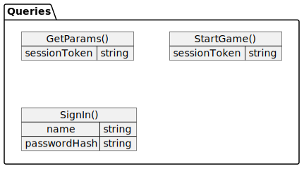
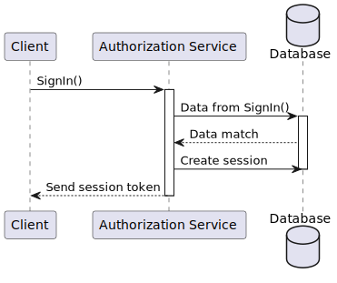
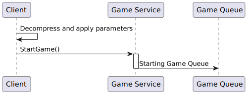

# Первое задание: Инструкция со схемой

## Authorization and starting the game queue

Full scheme for authorization and starting the game queue:

Queries data model:

### Authorization process

At first, the **Client** sends `SingIn()` query to **Authorization Service** to give it the user's name and password.
After that, **Authorization Service** goes to **Data Base** and makes sure that name and hashed password are correct.
If it is, then **Authorization Service** creates a session in Data Base and sends the session token to the **Client**.

On the scheme, this process looks like this:

### Getting parameters

If the authorization process ends well, the **Client** sends `GetParams()` query to the **Game Service**.

---

**Attention:**

`GetParams()` must include the correct session token from the authorization process.

---

After that, the **Game Service** asks for parameters from the **Data Base**.
**Data Base** gives it, and **Game Service** compresses and sends it to the **Client**.

On the scheme:

### Starting the game queue

After getting parameters, the **Client** decompresses and applies them.
If everything goes well, then the **Client** sends `StartGame()` to the **Game Service**.

---

**Attention:**

`StartGame()` must include the correct session token from the authorization process.

---

And then, **Game Service** starts the **Game Queue**.

On the scheme:

