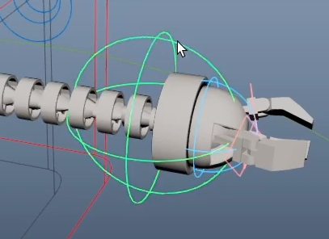
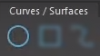
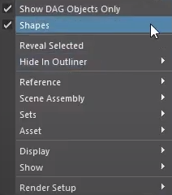
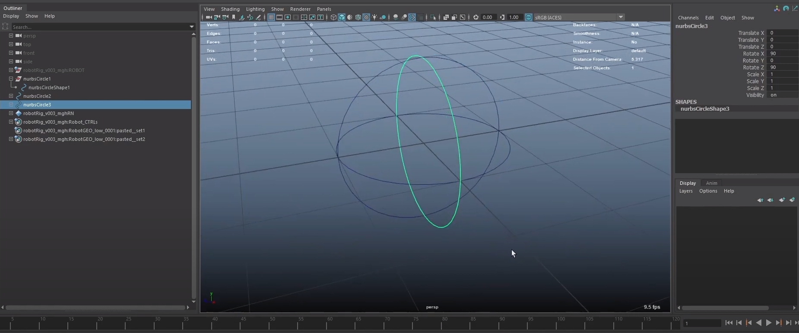
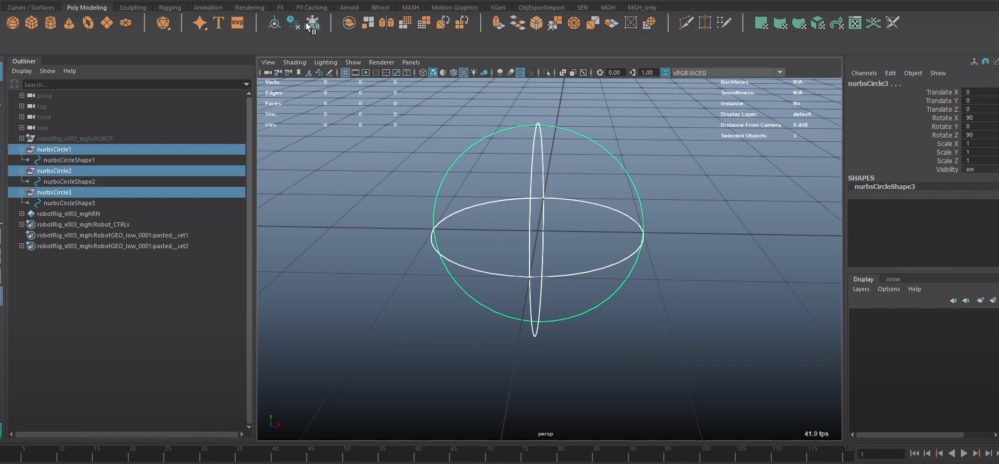
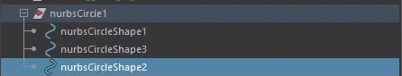
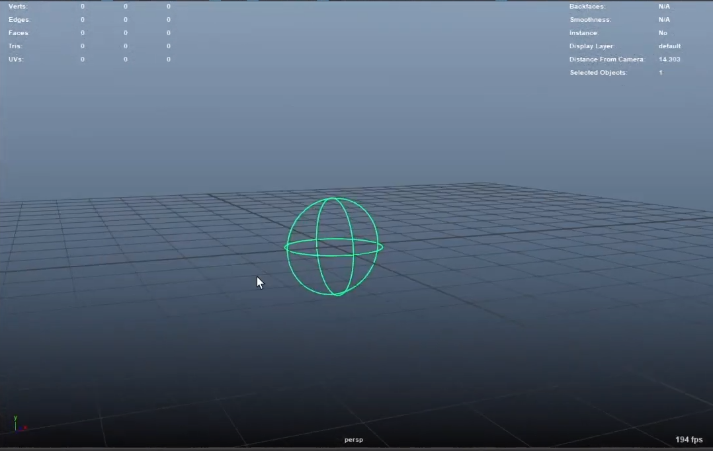
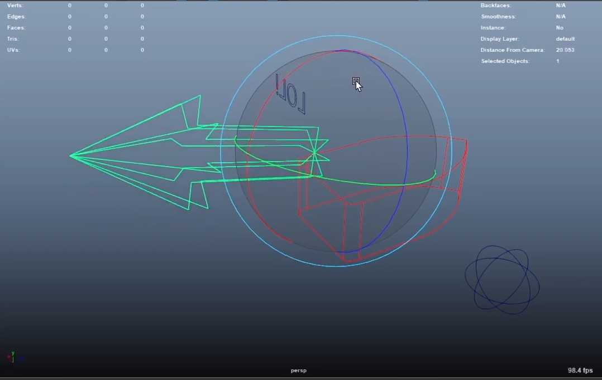

# Второе задание: Инструкция по Maya

## Как создать кастомный контроллер для рига в Maya?

Функционал Maya позволяет создавать собственные контроллеры для рига и использовать их в дальнейших проектах.

Создание контроллера мы разберём на простом примере, в котором есть всего три окружности.
В конце мы получилм такой контроллер:

### Создание окружностей

Изначально необходимо создать окружность. Она находится в панели **Curves / Surfaces** в самом левом углу.

Убедитесь, что у вас включено отображение нод фигур.
Для этого кликните правой кнопкой мыши по панели с элементами и проверьте активен ли чекбокс у пункта Shapes.

После этого вам необходимо создать дубликат окружности и повернуть её на 90 градусов по оси Z.
Потом создайте ещё один дубликат и поверните его на 90 градусов по осям X&nbsp;и&nbsp;Z.
В результате у вас должны получиться 3 окружности:

---

**Примечание:**

Чтобы было удобнее вращать окружности на равные градусы, зажимайте клавишу `J` на клавиатуре.

---

### Создание единой ноды трансформации

Перед дальнейшими действиями необходимо *заморозить* ноды трансформации.
Выделите все 3 ноды трансформации и на панели **Poly Modeling** нажмите кнопку **Freeze Transform**.

Это необходимо для того, чтобы в ноде фигуры зафиксировались координаты каждого круга.

Далее сначала выделите ноду фигуры дубликата, а потом ноду трансформации оригинала и внизу в строке **MEL** введите следующую команду:

    parent -r -s

Этой командой мы сделали ноду трансформации оригинального круга родительской для ноды фигуры дубликата.
Флаги `-r` и `-s` необходимы для того, чтобы операция прошла корректна. Подробнее в таблице:

|Команда | Описание |
|---|---|
| -relative (-r) | сохраняет существующие трансформации объектов. |
| -shape (-s) | `parent` обычно работает только с трансформационными нодами. Использование этого флага позволяет работать с нодами фигур. |

Повторите эти действия для второго дубликата. После этого все три ноды фигуры должны быть в одной ноде трансформации:

### Завершение

Если вы смогли повторить все шаги данной инструкции, то в конце у вас должен получиться вот такой контроллер:

С помощью этого метода можно создавать контроллеры абсолютно любой формы.

